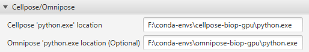
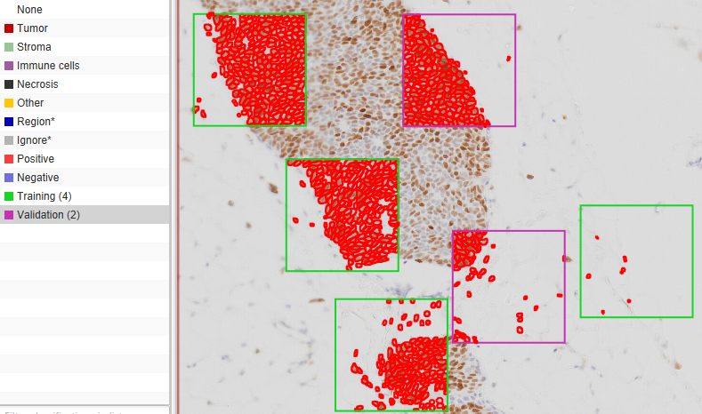

Zenodo DOI: [](https://zenodo.org/doi/10.5281/zenodo.10829243)


# QuPath Cellpose/Omnipose extension

This repo adds some support to use 2D Cellpose within QuPath through a Python virtual environment.

We also want to use Omnipose, which offers some amazing features, but there is currently no consensus between the 
developers and there are incompatibilities between the current Cellpose and Omnipose versions.

We have decided to provide support for both using cellpose and omnipose, in the form of two separate environments, so that
they can play nice. 

> [!WARNING]
> Versions from v0.11.0 of this extension **will only work on QuPath 0.6.0 or later**. Please update QuPath to the latest version. 
> In case you are stuck with QuPath v0.5.1, [the last release to work is v0.10.2](https://github.com/BIOP/qupath-extension-cellpose/releases/tag/v0.10.2)


> [!WARNING]
> - Currently, the cellpose-extension hasn't been tested on HPC clusters.


# Citing

Please cite this extension by linking it to this GitHub or to the release you used, and feel free to give us a star ⭐️

As this code is neither novel nor entirely original, there is no linked publication, but you can use the following Zenodo entry:

[](https://zenodo.org/doi/10.5281/zenodo.10829243)

## Code authorship
**Author**: Olivier Burri (1)

**Contributors**: Nicolas Chiaruttini (1), Romain Guiet (1), Rémy Dornier (1)

This code heavily makes use of functions created by Pete Bankhead and the QuPath team for their [StarDist Extension](https://github.com/qupath/qupath-extension-stardist)

**Affiliations**

(1) EPFL BioImaging and Optics Platform (BIOP)

### If you use this extension, you should cite the following publications

Stringer, C., Wang, T., Michaelos, M. et al **Cellpose: a generalist algorithm for cellular segmentation**. Nat Methods 18, 100–106 (2021). https://doi.org/10.1038/s41592-020-01018-x

Pachitariu, M., Stringer, C. **Cellpose 2.0: how to train your own model**. Nat Methods 19, 1634–1641 (2022). https://doi.org/10.1038/s41592-022-01663-4

Cutler, K.J., Stringer, C., Lo, T.W. et al. **Omnipose: a high-precision morphology-independent solution for bacterial cell segmentation**. Nat Methods 19, 1438–1448 (2022). https://doi.org/10.1038/s41592-022-01639-4

Bankhead, P. et al. **QuPath: Open source software for digital pathology image analysis**. Scientific Reports (2017). https://doi.org/10.1038/s41598-017-17204-5


# Installation

## Step 1: Install Cellpose and/or Omnipose

## Installation from the official Cellpose documentation
You will need a Python virtual environment with Cellpose working.  
Please follow the instructions to install Cellpose from [the main Cellpose repository](https://github.com/mouseland/cellpose#Installation). 
Likewise, for Omnipose please see [the main Omnipose repository](https://omnipose.readthedocs.io/installation.html)
Note that for GPU acceleration on Windows and Linux you may need to [install additional
CUDA packages](https://github.com/MouseLand/cellpose#gpu-version-cuda-on-windows-or-linux).

> [!NOTE]
> ### `scikit-image` Dependency
> As of version 0.4 of this extension, QC (quality control) is run **automatically** when training a model.
> Due to the dependencies of the validation Python script [run-cellpose-qc.py](QC/run-cellpose-qc.py) there is an extra dependency: `scikit-image`.
> 
> The simplest way to add it is to install it the same way you installed Cellpose or Omnipose in the same Python virtual environment.
> For example, if you used `pip` to install `cellpose` you would use:
> `python -m pip install scikit-image`
> or if you used `conda`:
> `conda install scikit-image`

### Get the path to the Python executable
This extension will then need to know *the path* (the location in your file system) to (at least) your Cellpose environment plus your Omnipose environment, 
if you plan on using Omnipose. You will need to enter this information in the QuPath Preferences when configuring the QuPath Cellpose extension.

> [!IMPORTANT]
> Make sure you activate your Cellpose environment and then check the path! 

For example, if you installed `cellpose` into an conda environment named `cellpose-omnipose-biop-gpu` then you can get the path 
to the Python executable using the command line or terminal  using the following two commands to activate the conda environment 
and locate the Python binary (the 3rd line is example output).  
On Windows:
```
> mamba activate cellpose-omnipose-biop-gpu
> where python
F:\conda-envs\cellpose-omnipose-biop-gpu\python.exe
```

On macOS or Linux:
```
> mamba activate cellpose-omnipose-biop-gpu
> which python
{HOME}/conda/envs/cellpose-omnipose-biop-gpu/bin/python
```
where `{HOME}` will be the location of your home directory, typically `/Users/user-name/` on macOS or `/home/user-name/` on Linux.

## Step 2: Install the QuPath Cellpose extension

### On QuPath 0.6.x
- Install and setup the [qupath-biop-catalog](https://github.com/BIOP/qupath-biop-catalog) first.

> [!NOTE]
> If your extensions directory is unset, create a new empty folder somewhere on your computer. On QuPath, go under `Edit -> Preferences -> Extensions` and browse the empty folder you've just created.
> Extensions will then be added inside this folder.

- Open QuPath and click on `Extensions -> Manage extensions`
- Expand the **QuPath-BIOP catalog** and add the cellpose extension (click on the green button)
- Select the version to install (the latest the better)
- Click on `Install`
- You might then need to restart QuPath (but not your computer).


### On QuPath 0.5.x
Download the latest `qupath-extension-cellpose-[version].zip` file from [releases](https://github.com/biop/qupath-extension-cellpose/releases) and unzip it into your `extensions` directory. 

If your extensions directory is unset, unzip and drag & drop `qupath-extension-cellpose-[version].jar` onto the main QuPath window. You'll be prompted to select a QuPath user directory.
The extension will then be copied to a location inside that directory.

To copy `run-cellpose-qc.py`, go to Extensions > Installed Extensions and click on "Open Extensions Directory". You can place the `run-cellpose-qc.py` in the same folder.

You might then need to restart QuPath (but not your computer).

> [!NOTE]
> In case you do not do this step, Cellpose training will still work, but the QC step will be skipped, and you will be notified that `run-cellpose-qc.py` cannot be found.
> Additionally, this is the step that requires `scikit-image` as noted above.

## QuPath Extension Cellpose/Omnipose: First time setup

Go to `Edit > Preferences > Cellpose/Omnipose`
Complete the fields with the requested information by pasting the path(s) you obtained above. 
Based on the `mamba` installation above, this is what it should look like on Windows:


> [!NOTE]
> You have the possibility to provide **two** different environments. One for Cellpose and one for Omnipose. 
> If you do not plan on using Omnipose or have installed both cellpose and Omnipose in the same environment, you can leave it blank.
> The reason for this is that there may be versions of cellpose and its dependencies that might not match with Omnipose. Adding to that, some parameters
> in cellpose and omnipose are currently out of sync, so it could be wiser to keep them separate.

**The extension handles switching between the two based on the `useOmnipose()` flag in the builder.**

> [!NOTE]
> Unless stated otherwise, this extension should work with the latest releases of both Cellpose and Omnipose.
> If this is not the case, please [open an issue on our GitHub](https://github.com/BIOP/qupath-extension-cellpose/issues/new) or [write a post on the Image.sc forum](https://forum.image.sc/new-topic?category=usage-issues&tags=cellpose-qupath,qupath-cellpose) detailing the problem and the steps necessary to reproduce it.

> [!NOTE]
> **Precisions for using Cellpose-SAM**
> 
> Cellpose-SAM comes with only one pre-trained model called **cpsam**, meaning that all other pre-trained models for previous cellpose version (ex: cyto2, cyto3...) are not compatible anymore.
> In order to ease the use of Cellpose-SAM and previous versions of Cellpose together within the QuPath extension, you can create 2 different python environments, one for each cellpose version.
> Then, under `Edit > Preferences > Cellpose/Omnipose`, add the path to Cellpose v < 4 and Cellpose-SAM under the corresponding field.
> Finally, **The extension handles switching between the two based on the `useCellposeSAM()` flag in the builder.** 

## Running Cellpose the first time in standalone

Cellpose needs to download the pretrained models the first time it is run. On some OSes, this does not work from within 
QuPath due to permission issues.

One trick is to **run Cellpose from the command line** once with the model you want to use. The download should work from there,
and you can then use it within the QuPath Extension Cellpose.

# Using the Cellpose QuPath Extension

## Prediction 

Running Cellpose is done via a script and is very similar to the excellent [QuPath StarDist Extension](https://github.com/qupath/qupath-extension-stardist)

You can find a template in QuPath in

`Extensions > Cellpose > Cellpose detection script template`

Or you can download the [Cellpose_detection_template.groovy](src/main/resources/scripts/Cellpose_detection_template.groovy) script from this repo and open it in the QuPath script editor.  

> [!IMPORTANT]
> Lines starting with `//` are commented out and are not used. To enable those parameters, delete the `//`. To disable a parameter, add `//` at the start of the line.
  
Make sure that line 26 `.channels()` has the name of the channel you wish to segment--or you can provide the number, starting with `0` for the first channel.

> [!NOTE]
> For brightfield images the R, G, and B channels are used. If you wish to use stains like `Hematoxylin`, you will need to add an extra line:  
> `def stains = getCurrentImageData().getColorDeconvolutionStains() // stain deconvolution`  
> *before* the `def cellpose = Cellpose2D.builder( pathModel )` line (line 23).  
> Next, you will need to comment out the `.channels( 'DAPI' )` line by adding `//` at the start.  
> Finally, in the next line, add this pre-processing step to deconvolve stains and get the first channel, channel `0`:  
>        `.preprocess( ImageOps.Channels.deconvolve(stains), ImageOps.Channels.extract(0) )`

All builder options that are implemented are documented [in the Javadoc](https://biop.github.io/qupath-extension-cellpose/).
You can pass additional options to `cellpose` by adding `.addParameter()` before the `.build()` line. For example on a macOS computer with Apple Silicon (e.g. M1, M2, M3) 
you can use `.addParameter("gpu_device", "mps")` to use the GPU.

> [!NOTE]
> By default the script will generate QuPath *detections* and not *annotations*. In order to obtain annotations (which can be edited and are needed for training, see below), you must uncomment line 44:
> `.createAnnotations()` by deleting the `//` at the beginning of the line.

> [!IMPORTANT]
> Prior to running the script ensure that you have created a Project and have an image open with an annotation *selected* (it will be highlighted in yellow).
> The script will segment cells within that annotation.

The first thing the script will do is create a sub-folder in your project called `cellpose-temp`, followed by exporting the image(s) that will be processed by `cellpose`.
If your segmentation is not what you expect, you can check that the exported image(s) represent what you intended for `cellpose` to segment.

Once you are happy with your script, you should save the edited copy to your Project (or another scripts folder) for re-use!

### Prediction using custom models
All you need to use a custom model or your own trained model is to provide the path to the model to the `Cellpose2D.builder`. Just replace the name of the pre-trained model (e.g. `cyto2`)
with the path to your model, for example:
```
// Specify the model name (cyto, nuclei, cyto2, omni_bact or a path to your custom model as a string)
def pathModel = 'C:/cellpose-custom-models/cellpose_residual_on_style_on_concatenation_off_train_2023_07_26_11_31_47.433625'
def cellpose = Cellpose2D.builder( pathModel )
```

## Training custom models

**Requirements**:
A QuPath project with rectangles of class "Training" and "Validation" inside which the ground truth objects have been painted as annotations with no class.


> [!IMPORTANT]
> Training requires _dense_ annotations. This means you cannot just annotate a few objects per Training and Valudation rectanble. You must annotate **ALL relevant objects** within each of those regions!

We typically create a standalone QuPath project for training only. This project will contain the training images along with the ground truth annotations drawn in QuPath.
Here are some reasons we do it this way:

1. Separating training and prediction/analysis makes for clean project structures and easier sharing of the different steps of your workflow.
2. In case we need to get more ground truth, we can simply fire up the relevant QuPath project and rerun the training, and then import the newly trained model into any other project that might need it.

**Protocol**

1. In your QuPath project create at least **2** rectangle annotations.
2. In the Annotations tab, add new classes name "Training" and "Validation" and assign your rectangles to each of them. You do not need an equal number of Training and Validation rectangles. 
3. Lock the rectangles (right click > Annotations > Lock). 
4. Draw your ground truth annotations within all of the rectangles. You can also select each rectangle and run the `Cellpose detection script template` with the `.createAnnotations()` line
   not commented out in the builder (see *Prediction* instructions above) to use a pre-trained cellpose model as a start, but make sure you manually correct it to get proper ground truth!
   
> [!IMPORTANT]
> Any ground truth annotations must have **no classes** assigned.

5. Repeat this for as many images/regions of interest as you would like.

> [!WARNING]
> All images with Training or Validation annotations in the project will be used for the training.

Once you have your labeled Training and Validation rectangles with ground truth annotations, make sure you save your project! Then you can run the Cellpose training template script in 
`Extensions > Cellpose > Cellpose training script template`

Or you can download [Cellpose_training_template.groovy](src/main/resources/scripts/Cellpose_training_template.groovy) from this repo and run it from the script editor.

> [!NOTE]
> In the line `def cellpose = Cellpose2D.builder("cyto")` you can choose to fine-tune a pre-trained model (e.g. cyto), train from scratch (enter "None"),
> or start with a custom model (see below). Please see the *Prediction* instructions above for information regarding the other builder parameters.

The first thing the script will do is create a sub-folder in your project called `cellpose-training` containing sub-folders `test` and `train`, followed by exporting the image(s)
that will be processed by `cellpose`. The `train` folder will contain images of your training rectangles and your annotations converted to masks. The `test` folder will contain the
Validation data, which is also used by the `QC` script. If your Validation is not what you expect, you can check that the exported image(s) represent what you intended for `cellpose` to train on.

Once the script successfully completes training, you will have a `models` sub-folder within your Project folder, which will contain your custom model, as well as a `QC` sub-folder with the output
of the QC script.

Once you are happy with your training script, you should save the edited copy to your Project (or another scripts folder) for re-use!

### Training a custom model
To train using your custom model, you need to provide the path to the model to the `Cellpose2D.builder`. Just replace the name of the pre-trained model (e.g. `cyto`)
with the path to your model, for example:
```
// Specify the model name (cyto, nuclei, cyto2, omni_bact or a path to your custom model as a string)
def pathModel = 'C:/cellpose-custom-models/cellpose_residual_on_style_on_concatenation_off_train_2023_07_26_11_31_47.433625'
def cellpose = Cellpose2D.builder( pathModel )
```

> [!NOTE]  
> If you decide that your model needs more training, you can add more images to the Project and provide more annotated Training rectangles.  
> You can use your custom model to segment additional Training rectangles, as described in the *Prediction* section above. Just be sure to 
> perform careful manual correction!  
> Then save the Project and re-run the training script with the path of the custom model from the previous training step.  
> If you save your edited Prediction and Training scripts, you can repeat this process as needed, by adding more training data and training the model
> obtained from the previous run--just edit the path to the model.  
> This is analogous to the `cellpose` 2.0 GUI `human-in-the-loop` process.

### More training options
[All options in Cellpose](https://github.com/MouseLand/cellpose/blob/45f1a3c640efb8ca7d252712620af6f58d024c55/cellpose/__main__.py#L36) 
have not been transferred. 

In case that this might be of use to you, please [open an issue](https://github.com/BIOP/qupath-extension-cellpose/issues). 

### Training validation
You can find a [run-cellpose-qc.py](QC/run-cellpose-qc.py) python script in the `QC` folder of this repository. This is 
an adaptation of the Quality Control part of a [ZeroCostDL4Mic Notebook that was made for cellpose](https://colab.research.google.com/github/HenriquesLab/ZeroCostDL4Mic/blob/master/Colab_notebooks/Beta%20notebooks/Cellpose_2D_ZeroCostDL4Mic.ipynb).

Basically, when you train using this extension:
1. It will first train your model as expected
2. It will then run your newly trained cellpose model on your "Validation" images
3. At the end, it will run the [run-cellpose-qc.py](QC/run-cellpose-qc.py) python script to output validation metrics.
4. The validation metrics will be saved into a folder called `QC` in your QuPath Project


### Saving training results for publication purposes

In order to be as reproducible and sure of your results as possible, especially when it comes to publishing, these are 
our current guidelines:
1. Use `saveBuilder()` which saves a JSON file of your CellposeBuilder, which can be reused with `CellposeBuilder(File builderFile)`. That way you will not lose the setting your did
2. Save the `cellpose-training`, `QC` and `models` folders at the end of your training somewhere. This will contain everything that was made during training.
3. Save the training script as well.

### Breaking changes after QuPath 0.4.0
In order to make the extension more flexible and less dependent on the builder, a new Builder method `addParameter(name, value)` is available that can take [any cellpose CLI argument or argument pair](https://cellpose.readthedocs.io/en/latest/command.html#options). 
For this to work, some elements that were "hard coded" on the builder have been removed, so you will get some errors. For example: `excludeEdges()` and `clusterDBSCAN()` no longer exist. 
You can use `addParameter("exclude_on_edges")`, and `addParameter("cluster")` instead.

# Building

You can build the QuPath Cellpose extension from source with

```bash
gradlew clean build
```

The output will be under `build/libs`.

* `clean` removes anything old
* `build` builds the QuPath extension as a *.jar* file and adds it to `libs`

# Notes and debugging

## Preprocessing your data, extracting Color Deconvolution stains

It has been useful to preprocess data to extract color-deconvolved channels feeding these to Cellpose, for example. This is where the `preprocess()` method is useful. 
Depending on the export, one might need to inform cellpose of which channel is to be considered nuclear and which channel cytoplasmic. The method `cellposeChannels()` helps to set the order, as in the example below.
```
def stains = getCurrentImageData().getColorDeconvolutionStains()
// ..
// .. builder is initialized before this line
.preprocess( ImageOps.Channels.deconvolve(stains),
             ImageOps.Channels.extract(0, 1) ) // 0 for HTX and 1 for DAB
. cellposeChannels(2, 1)                       // Use the second channel from the extracted image for the cytoplasm and the first channel for the nucleus in cellpose
```
## `Warn: No compatible writer found`
So far we experienced the `No compatible writer found` issue in the following cases:

1. The channel names were incorrect in the builder, so the image writer could not find the requested channels
2. The rectangles were too close or beyond the edges of the image, so there were no pixels to export
3. There were special characters in the file name, which caused it to fail.

## Overlap

In case you end up with split detections, this is caused by the overlap calculation not being done correctly or by setting the `.diameter()` to 0 in order for cellpose to determine it automatically.
In turn, this causes the QuPath extension to fail to extract tiles with sufficient overlap.
Use `setOverlap( int )` in the builder to set the overlap (in pixels) to a value 2x larger than the largest object you are segmenting.

### To find the overlap

You can draw a line ROI across your largest object in QuPath and run the following one-line script
```
print "Selected Line length is " + Math.round(getSelectedObject().getROI().getLength()) + " pixels"
```
Double whatever value is output from the script and use it in `setOverlap( int )` in the builder.

## Ubuntu Error 13: Permission Denied
[As per this post here](https://forum.image.sc/t/could-not-execute-system-command-in-qupath-thanks-to-groovy-script-and-java-processbuilder-class/61629/2?u=oburri), there is a permissions issue when using Ubuntu, which does not allow Java's `ProcessBuilder` to run. 
The current workaround is [to build QuPath from source](https://qupath.readthedocs.io/en/stable/docs/reference/building.html) in Ubuntu, which then allows the use of the `ProcessBuilder`, which is the magic piece of code that actually calls Cellpose.
